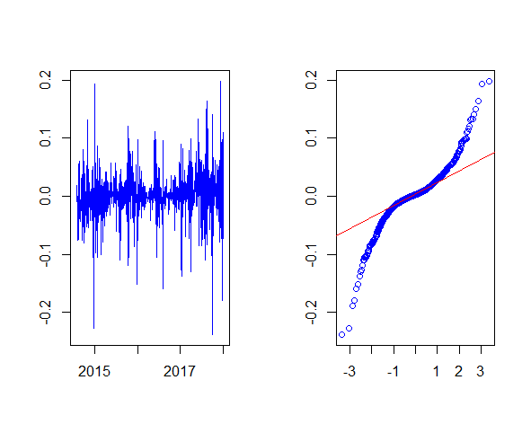
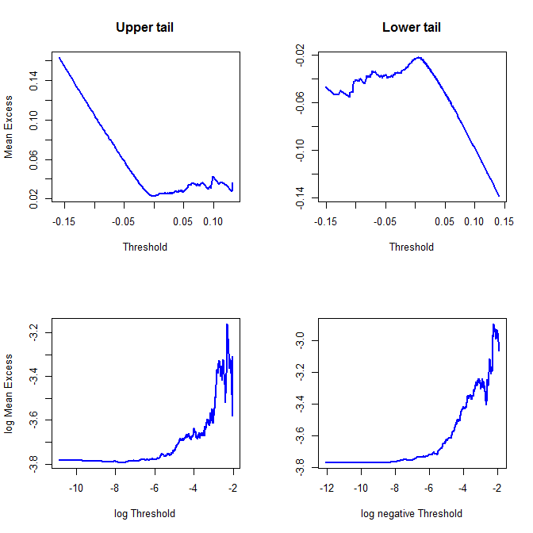

[](http://quantlet.de/)

## [](http://quantlet.de/) **SRMC_QQ_ME_crix** [](http://quantlet.de/)

```yaml


Name of Quantlet: SRMC_QQ_ME_crix

Published in: unpublished

Description: 'Times series of log returns of CRIX and normal Q-Q plot, and Mean excess function and log Mean excess function for both tails'

Keywords: 'CRIX, Mean excess function, heavy tail, Weibull-type tail, Q-Q plot'

Author: Chengxiu Ling

See also: 'SRMC_crix, SRMC_Estimation_crix'

Submitted: 07/02/2018 

Input: 

- alpha:  'the probability level vector for VaR and ES'

- index: 'any subset of  c(Normal, Laplace, Power-like), indicating the choice of contamination model'

- scale: 'the scale vector of the contamination model indicated by index'

- epsilon: 'small contamination level vector'

Output:  

- 1: 'SRMC_QQ_ME_crix_1.png, times series of CRIX and Q-Q normal plot'

- 2: 'SRMC_QQ_ME_crix_2.png, mean excess function and log mean excess function'


```





### R Code
```r

#' @title Analyze if the log return of crix is normal distributed or heavy tailed 
#' @input SRMC_crix.csv, the log returns of crix during 2014.07-2018.01
#' @return Times series of CRIX and Q-Q normal plot
#' @return Mean excess function and log Mean excess function

#' @useage Q-Q normal plot to summarize non-normal and heavy tails features, 
#' @useage Mean-excess function to show its heaviness tail among Power-decay or exponential decay
#' @useage log Mean-excess function to show the subexponential tails with Weibull-type tails(tau) 
#' @useage tau >, =, < 1 to see the superexponential, exponential or subexponential tails
#' @references see Dierckx, G., Beirlant, J., DeWaal, D. and Guillou, A. (2009). 
#' A new estimation method for Weibulltype tails based on the mean excess function, 
#' Journal of Statistical Planning and Inference. 139(6): 1905-1920.

# clear variables and and close windows
rm(list = ls(all = TRUE))
graphics.off()

# Read the price data and the date as well
price = read.csv(file = "SRMC_crix")$price
date = read.csv(file = "SRMC_crix")$date
date.original = date[1]
size.crix = length(price)
random.dates = as.Date(date.original) + size.crix * sort(stats::runif(size.crix))

par(mfrow = c(1, 2))
# Time series of log returns of CRIX price
plot(random.dates, price, xlab = "", ylab = "", col = "blue", type = "l")

# normal Q-Q plot of log returns of CRIX
qqnorm(price, xlab = "", col = "blue", ylab = "", main = "")
qqline(price, col = 2)
# Give SRMC_QQ_ME_crix_1.png

# Calculate empirical mean excess function of e_X(t)) = E(X - t | X > t) 
# at threshold x_{n-k,n}, the (k+1)th upper order statistics
m.upper.excess = function(k, x) {
    x = sort(x, decreasing = T)
    mean_excess = mean(x[1:k] - x[k + 1])
    return(mean_excess)
}

# Calculate empirical mean excess function (lower tail)o f e_X(t)) = E(X - t | X < t) 
# at threshold x_{k+1,n}, the (k+1)th lower order statistics

m.lower.excess = function(k, x) {
    x = sort(x, decreasing = F)
    mean.lower.excess = mean(x[1:k] - x[k + 1])
    return(mean.lower.excess)
}

n = length(price)
order.k = 5:(n - 5)
threshold.upper = sort(price, decreasing = T)[order.k + 1]
threshold.lower = sort(price, decreasing = F)[order.k + 1]
mexcess.upper = sapply(order.k, m.upper.excess, price)
mexcess.lower = sapply(order.k, m.lower.excess, price)

# log (x_{n-k, n}), the log threshold of upper order statistics
threshold.upper.log = log(threshold.upper[which(threshold.upper > 0)])

# log (- x_{k+1, n}), the log negative threshold of lower order statistics
threshold.lower.log.negative = log(-threshold.lower[which(threshold.lower < 0)])

# log ( e_X(t) ), the log mean excess function at threshold of upper order statistics
mexcess.upper.log = log(mexcess.upper[which(threshold.upper > 0)])

# log ( - e_X(t) ), the log negative mean excess function at threshold of lower order statistics
mexcess.lower.log.negative = log(-mexcess.lower[which(threshold.lower < 0)])

dev.new()
par(mfrow = c(2, 2))
# Mean excess function of the upper and lower tails
plot(threshold.upper, mexcess.upper, type = "l", lwd = 2, col = "blue", xlab = "Threshold", 
    ylab = "Mean Excess", main = "Upper tail")
plot(threshold.lower, mexcess.lower, type = "l", lwd = 2, col = "blue", xlab = "Threshold", 
    ylab = "", main = "Lower tail")

# log mean excess function of the upper and lower tails
plot(threshold.upper.log, mexcess.upper.log, type = "l", lwd = 2, col = "blue", xlab = "log Threshold", 
    ylab = "log Mean Excess", main = "")
plot(threshold.lower.log.negative, mexcess.lower.log.negative, type = "l", lwd = 2, col = "blue", 
    xlab = "log negative Threshold", ylab = "", main = "")
# Give SRMC_QQ_ME_crix_2.png
 

```

automatically created on 2018-05-28